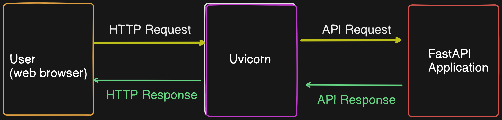

## FastAPI with Redis in Docker: Complete Guide

### Overview

This guide will walk you through the process of creating a FastAPI application that interacts with a Redis database. The application will be containerized using Docker and Docker Compose. We will also cover how to test the Redis database using telnet and the API endpoints using `curl`.


### Directory Structure

Ensure your project directory is structured as follows:

```
~redis-api/
├── docker-compose.yml
├── app/
│   ├── Dockerfile
│   ├── main.py
│   └── requirements.txt
└── redis/
    └── Dockerfile (if any custom Redis setup is needed)
```

### Step 1: Setting Up FastAPI Application

#### `app/main.py`

Create the FastAPI application with CRUD operations for user records.

```python
from fastapi import FastAPI, HTTPException
from pydantic import BaseModel, EmailStr
import redis

app = FastAPI()

# Initialize Redis client
redis_client = redis.Redis(host='redis', port=6379)

# Define User model
class User(BaseModel):
    name: str
    email: EmailStr

@app.get("/")
def read_root():
    return {"message": "Welcome to the Redis API"}

@app.post("/users/")
def create_user(user: User):
    user_key = f"user:{user.email}"
    if redis_client.exists(user_key):
        raise HTTPException(status_code=400, detail="User already exists")
    redis_client.hset(user_key, mapping={"name": user.name, "email": user.email})
    return {"message": "User created successfully"}

@app.get("/users/{email}")
def get_user(email: str):
    user_key = f"user:{email}"
    if not redis_client.exists(user_key):
        raise HTTPException(status_code=404, detail="User not found")
    user_data = redis_client.hgetall(user_key)
    user = {key.decode('utf-8'): value.decode('utf-8') for key, value in user_data.items()}
    return user

@app.put("/users/{email}")
def update_user(email: str, user: User):
    user_key = f"user:{email}"
    if not redis_client.exists(user_key):
        raise HTTPException(status_code=404, detail="User not found")
    redis_client.hset(user_key, mapping={"name": user.name, "email": user.email})
    return {"message": "User updated successfully"}

@app.delete("/users/{email}")
def delete_user(email: str):
    user_key = f"user:{email}"
    result = redis_client.delete(user_key)
    if not result:
        raise HTTPException(status_code=404, detail="User not found")
    return {"message": "User deleted successfully"}

@app.get("/users/")
def get_all_users():
    keys = redis_client.keys('user:*')
    users = []
    for key in keys:
        user_data = redis_client.hgetall(key)
        user = {key.decode('utf-8'): value.decode('utf-8') for key, value in user_data.items()}
        users.append(user)
    return {"users": users}
```

#### `app/requirements.txt`

List the necessary dependencies.

```
fastapi
uvicorn
redis
pydantic
```

#### `app/Dockerfile`

Set up the Dockerfile for the FastAPI application.

```Dockerfile
# Use an official Python runtime as a parent image
FROM python:3.9

# Set the working directory in the container
WORKDIR /app

# Copy the current directory contents into the container at /app
COPY . /app

# Install any needed packages specified in requirements.txt
RUN pip install --no-cache-dir -r requirements.txt

# Make port 8000 available to the world outside this container
EXPOSE 8000

# Run uvicorn server
CMD ["uvicorn", "main:app", "--host", "0.0.0.0", "--port", "8000"]
```

 - CMD ["uvicorn", "main:app", "--host", "0.0.0.0", "--port", "8000"]: This line specifies the command to run the application using Uvicorn, binding to all IP addresses (0.0.0.0) and listening on port 8000.

*What is UVICORN?*
Uvicorn is a lightning-fast ASGI (Asynchronous Server Gateway Interface) web server designed to serve Python web applications. It is particularly well-suited for handling modern web frameworks like FastAPI and Starlette, which utilize asynchronous programming for high performance. Uvicorn is responsible for receiving HTTP requests, processing them, and returning responses efficiently, making it an essential component for deploying and running scalable web applications.




### Step 2: Setting Up Docker Compose

#### `docker-compose.yml`

Configure Docker Compose to build and run the FastAPI app and Redis.

```yaml
version: '3.8'

services:
  app:
    build:
      context: ./app
    ports:
      - "8000:8000"
    depends_on:
      - redis

  redis:
    image: "redis:latest"
    ports:
      - "6379:6379"
```
### Install Docker Compose on Ubuntu

1. First, update your package index:

    ```sh
    sudo apt update
    ```

2. Install the required packages to ensure that `curl` and `gnupg` are installed:

    ```sh
    sudo apt install curl gnupg
    ```

3. Download the Docker Compose binary into the `/usr/local/bin` directory:

    ```sh
    sudo curl -L "https://github.com/docker/compose/releases/latest/download/docker-compose-$(uname -s)-$(uname -m)" -o /usr/local/bin/docker-compose
    ```

4. Apply executable permissions to the binary:

    ```sh
    sudo chmod +x /usr/local/bin/docker-compose
    ```

5. Verify that `docker-compose` is installed correctly:

    ```sh
    docker-compose --version
    ```

We should see the version of Docker Compose printed to the terminal.

### Step 3: Building and Running the Project

Navigate to your project directory and run the following commands:

```sh
cd redis-api
sudo docker-compose up --build
```

### Step 4: Testing Redis Accessibility Using Telnet

To test if Redis is accessible using telnet, follow these steps:

1. Ensure your Redis container is running:

   ```sh
   sudo docker-compose up
   ```

2. Install telnet (if not already installed):

   ```sh
   sudo apt-get install telnet
   ```

3. Test Redis using telnet:

   ```sh
   telnet localhost 6379
   ```

   - The command telnet localhost 6379 establishes a Telnet connection to the Redis server running on your local machine at port 6379, allowing you to directly issue Redis commands.

   To test basic Redis commands, type:

   ```sh
   PING
   ```

   You should see a response:

   ```
   +PONG
   ```

4. Exit telnet:

   - Press `Ctrl + ]`.
   - Type `quit` and press `Enter`.

   

### Step 5: Testing the API Endpoints

Use tools like `curl`, Postman, or any HTTP client of your choice to test the API endpoints.

#### Create a User

```sh
curl -X POST "http://localhost:8000/users/" -H "Content-Type: application/json" -d '{"name": "John Doe", "email": "john@example.com"}'
```

#### Get a User

```sh
curl "http://localhost:8000/users/john@example.com"
```

#### Update a User

```sh
curl -X PUT "http://localhost:8000/users/john@example.com" -H "Content-Type: application/json" -d '{"name": "John Smith", "email": "john@example.com"}'
```

#### Delete a User

```sh
curl -X DELETE "http://localhost:8000/users/john@example.com"
```

#### Get All Users

```sh
curl "http://localhost:8000/users/"
```

### Step 6: Viewing Redis Data

#### Access Redis CLI in Docker

1. **Run Redis CLI in Docker Container**

   ```sh
   sudo docker exec -it redis-api-redis-1 sh
   ```

   Replace `redis-api_redis_1` with your container's name if it's different.

2. **Start Redis CLI**

   ```sh
   redis-cli
   ```

#### View Data in Redis

- **List all keys:**

  ```sh
  KEYS *
  ```
  
- **View all fields and values of a hash:**

  ```sh
  HGETALL user:email@example.com
  ```

  Replace `user:email@example.com` with the actual key of the hash you want to view.

#### Exit Redis CLI

To exit the Redis CLI, simply type:

```sh
exit
```

To exit the Docker container shell, type:

```sh
exit
```

### Conclusion

This guide provides a complete setup for a FastAPI application with Redis, containerized using Docker. You can now manage user records with name and email, and test your setup using telnet for Redis and `curl` for API endpoints. This setup ensures a robust and scalable application ready for development and deployment.